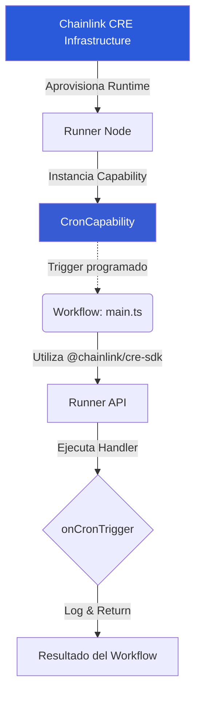
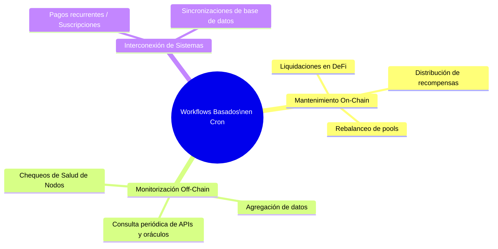
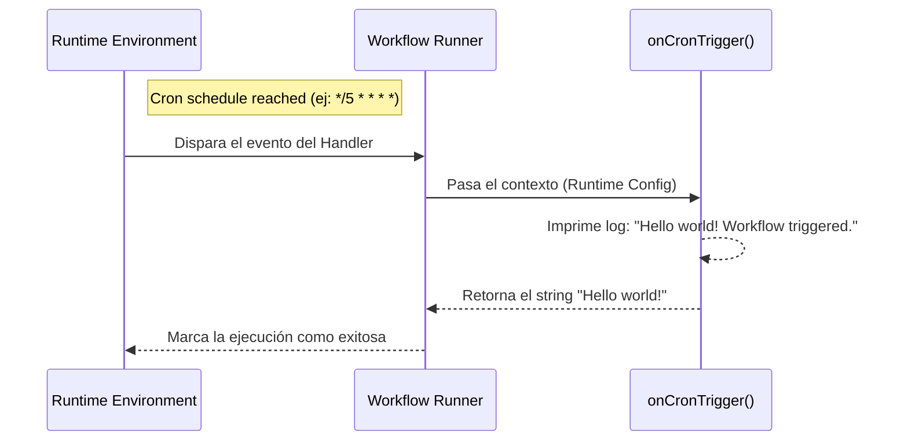

# Hello World TS - Chainlink CRE (Chainlink Runtime Environment)

Esta plantilla proporciona un ejemplo básico de flujo de trabajo ("Hello World") en TypeScript. Está diseñada para ayudarte a entender la estructura fundamental de **Chainlink CRE (Chainlink Runtime Environment)** y cómo simular flujos de trabajo locales.

## 📖 ¿Qué es "Hello World TS" en Chainlink CRE?

Chainlink CRE es un entorno descentralizado que permite a los desarrolladores escribir, testear y ejecutar flujos de trabajo automatizados apoyándose en la infraestructura de los oráculos de Chainlink, sin depender de servidores centralizados propios.

En este ejemplo de **"Hello World TS"**, el flujo de trabajo ilustra el concepto más básico de CRE:
**Una función lógica desencadenada de manera programada a través de un *Cron Job* que se ejecuta en su propio entorno aislado** (off-chain).

---

## 🏗 Arquitectura del Proyecto

El ecosistema Chainlink CRE asocia capacidades estandarizadas (Capabilities) con la lógica personalizada del usuario (Workflows).



**Componentes principales**:
* `main.ts`: Entrada principal del flujo que orquesta el desencadenador (*Cron*) y la función controladora.
* `workflow.yaml`: Fichero de manifiesto con perfiles de configuración (Staging, Production) y variables.
* `@chainlink/cre-sdk`: El SDK para interactuar con tiempos de ejecución (runtimes), logs, capacidades y handlers.

---

## 🎯 Caso de Uso

**¿Para qué sirve un desencadenador *Cron* en Chainlink CRE?**
Automatizar tareas es vital en web3 para que los *Smart Contracts* no dependan de scripts externos y variables frágiles.



Aunque este ejemplo simplemente imprime un log "Hello world!", la base es la misma para cualquiera de estos sistemas que necesiten de un entorno autónomo repetitivo.

---

## ⚙️ Proceso (Flujo de Ejecución)

El comportamiento se detalla en el siguiente diagrama secuencial que refleja el ciclo de vida gestionado por el SDK.



1. **Trigger Configurado:** En `main.ts`, se usa `cron.trigger(...)` con un horario configurado (*schedule*).
2. **El Handler:** La función `onCronTrigger` recibe el entorno (runtime) y se ejecuta en un ambiente reproducible sin efectos secundarios inesperados.
3. **Runner:** Toda la infraestructura abstracta es envuelta por la llamada final `await runner.run(initWorkflow)`. 

---

## 🚀 Proceso para Hacer Correr el Proyecto

Sigue estos pasos para instalar dependencias y ejecutar la simulación en tu máquina local de Windows.

### 1. Requisitos Previos
* Necesitas tener [Bun](https://bun.sh/) instalado.
* Tener el **Chainlink CLI (`cre`)** instalado en tu sistema.

### 2. Configurar Variables de Entorno (`.env`)
Agrega el archivo `.env` en el directorio principal de tu espacio de trabajo (`my-project-cre` y no dentro de `hellow_world_TS`). Como no vamos a interactuar on-chain directamente con este Hello World, basta con utilizar una clave falsa:
```env
CRE_ETH_PRIVATE_KEY=0000000000000000000000000000000000000000000000000000000000000001
```

### 3. Instalar Dependencias
Abre tu consola/terminal directamente en el directorio de la plantilla (`hellow_world_TS`):
```bash
cd hellow_world_TS
bun install
```

### 4. Simular el Flujo de Trabajo
Para iniciar la simulación local de Chainlink CRE, regresa a la **raíz del proyecto** (`my-project-cre`) y ejecuta:
```bash
cre workflow simulate hellow_world_TS --target staging-settings
```
*Tip: El parámetro `--target` hace que el CLI busque en `workflow.yaml` y asigne `config.staging.json` y la ruta al manejador `main.ts` correctamente.*

---

## 🧪 Pruebas (Tests)

Mantener el código determinista es crucial en aplicaciones descentralizadas de CRE. Por eso este template viene con una serie de pruebas pre-compiladas en `main.test.ts`.

### ¿Cómo correr las pruebas?
Dentro de la carpeta `hellow_world_TS`, ejecuta el test-runner en tu terminal:
```bash
bun test
```

### ¿Qué comprueban los tests?
Las pruebas usan las dependencias del SDK de Test (`newTestRuntime`, `test`):
1. **Lógica Pura (`onCronTrigger`):** Garantizan que el handler guarde su registro en el objeto log (`logs.toContain("...Workflow triggered.")`) y devuelva estrictamente `'Hello world!'`.
2. **Validación del Workflow (`initWorkflow`):** Se asegura de que el array retornado tenga un solo handler (`toHaveLength(1)`), y que ese desencadenador específico de cron mantenga el "schedule" asignado (ej. `"0 0 * * *"`).
3. **Flujo Simulado:** Genera una simulación del entorno y dispara la función completa para asegurar que la delegación por la plataforma de Chainlink funcionará sin excepciones.
